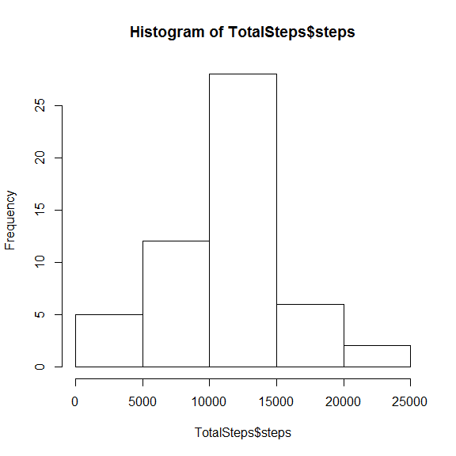
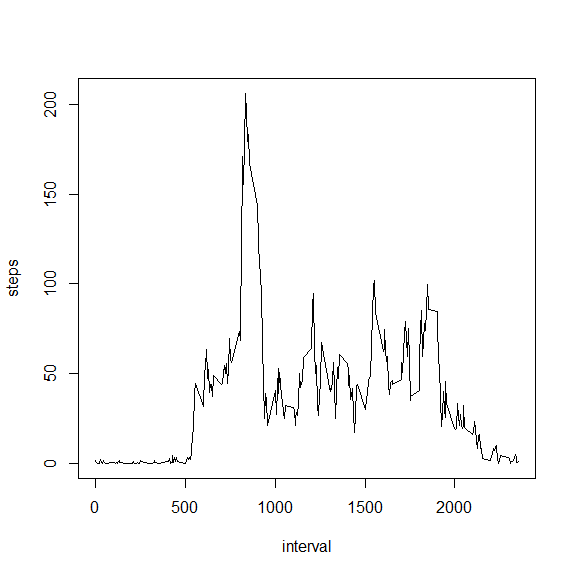
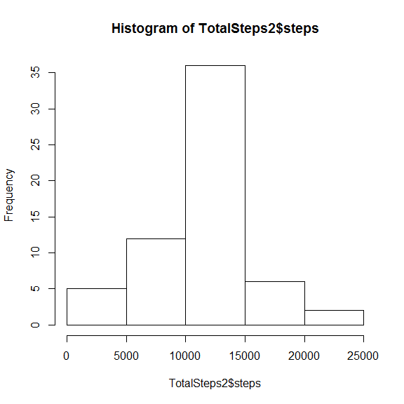
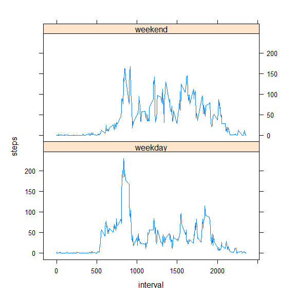

# Reproducible Research: Peer Assessment 1


## Loading and preprocessing the data

- Load the data

```r
Activity <- read.csv("activity.csv", header = TRUE, sep = ",")
```


- Process/transform the data (if necessary) into a format suitable for your analysis

```r
Activity$date <- as.Date(Activity$date, format = "%Y-%m-%d")
```


## What is mean total number of steps taken per day?

- Calculate the total number of steps taken per day

```r
TotalSteps <- aggregate(steps ~ date, data = Activity, sum, na.rm = TRUE)
```


- Make a histogram of the total number of steps taken each day

```r
hist(TotalSteps$steps)
```

 


- Calculate and report the mean and median of the total number of steps taken per day

```r
MeanSteps <- round(mean(TotalSteps$steps), digits = 0)
```

```r
MedianSteps <- median(TotalSteps$steps)
```

The mean total number of steps taken per day is 1.0766\times 10^{4}.

The median total number of steps taken per day is 10765.


## What is the average daily activity pattern?

- Make a time series plot (i.e. type = "l") of the 5-minute interval (x-axis) and the average number of steps taken, averaged across all days (y-axis)

```r
StepsInterval <- aggregate(steps ~ interval, data = Activity, mean, na.rm = TRUE)
```

```r
plot(steps ~ interval, data = StepsInterval, type = "l")
```

 


- Which 5-minute interval, on average across all the days in the dataset, contains the maximum number of steps?

```r
MaxNumberOfSteps <- StepsInterval[which.max(StepsInterval$steps), ]$interval
```

The 5-minute interval containing the maximum number of steps is the 835th interval.


## Imputing missing values

- Calculate and report the total number of missing values in the dataset (i.e. the total number of rows with NAs)

```r
CountNA <- sum(is.na(Activity$steps))
```

There is 2304 missing values in the dataset.


- Devise a strategy for filling in all of the missing values in the dataset. The strategy does not need to be sophisticated. For example, you could use the mean/median for that day, or the mean for that 5-minute interval, etc.

My strategy will use the mean for that 5-minute interval. I made a function to calculate the mean steps for each 5-minute interval. 


```r
IntervalBetweenSteps <- function(interval) {
    StepsInterval[StepsInterval$interval == interval, ]$steps
}
```


- Create a new dataset that is equal to the original dataset but with the missing data filled in.

```r
ActivityNoNas <- Activity

count = 0

for (i in 1:nrow(ActivityNoNas)) {

  if (is.na(ActivityNoNas[i, ]$steps)) {
        ActivityNoNas[i, ]$steps <- IntervalBetweenSteps(ActivityNoNas[i, ]$interval)
        
        count = count + 1
    }
}
```


- Make a histogram of the total number of steps taken each day

```r
TotalSteps2 <- aggregate(steps ~ date, data = ActivityNoNas, sum)
```

```r
hist(TotalSteps2$steps)
```

 


- Calculate and report the mean and median total number of steps taken per day. 

```r
MeanSteps2 <- round(mean(TotalSteps2$steps), digits = 0)
```

```r
MedianSteps2 <- median(TotalSteps2$steps)
```

The mean total number of steps taken per day is 1.0766\times 10^{4}.

The median total number of steps taken per day is 1.0766189\times 10^{4}.


- Do these values differ from the estimates from the first part of the assignment? What is the impact of imputing missing data on the estimates of the total daily number of steps?

Using the mean for each 5-minute interval in lieu of missing values (NAs) has no impact on the mean and median values.
The mean value is the same as before, while the median value is only slightly different.


## Are there differences in activity patterns between weekdays and weekends?

- Create a new factor variable in the dataset with two levels - "weekday" and "weekend" indicating whether a given date is a weekday or weekend day.

```r
ActivityNoNas$day = ifelse(weekdays(ActivityNoNas$date) == "Saturday" | weekdays(ActivityNoNas$date) == "Sunday", "weekend", "weekday")
```


- Make a panel plot containing a time series plot (i.e. type = "l") of the 5-minute interval (x-axis) and the average number of steps taken, averaged across all weekday days or weekend days (y-axis).


```r
IntervalBetweenSteps = aggregate(steps ~ interval + day, ActivityNoNas, mean)
```


```r
xyplot(steps ~ interval | factor(day), data = IntervalBetweenSteps, aspect = 1/2, type = "l")
```

 

